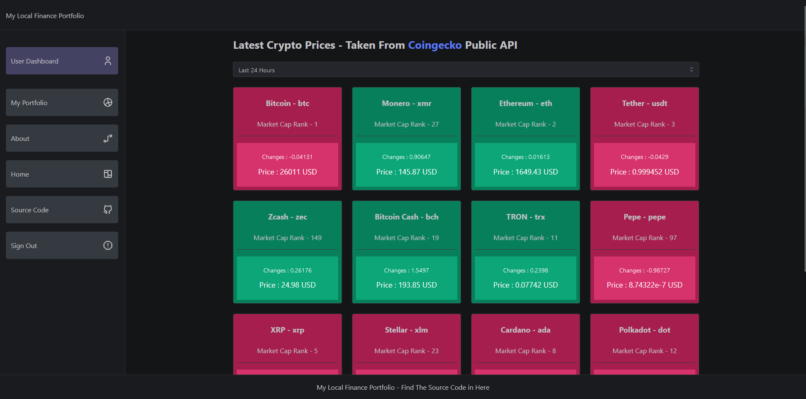

# 📪 Homepage

## What You Can Do in Homepage

For Now You Can see Live Prices From the Coins That Are Supported For Now , i Might Add More , The Data are coming From Coingecko Public API so they Must Be Fresh. You Can Also Choose a Time Range to See the Changes In General in Those Ranges.

<figure><figcaption></figcaption></figure>
