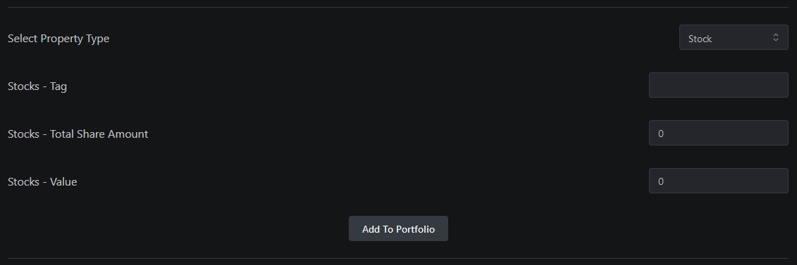
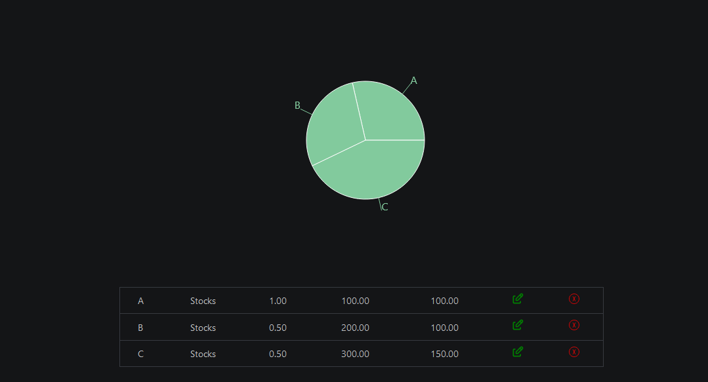
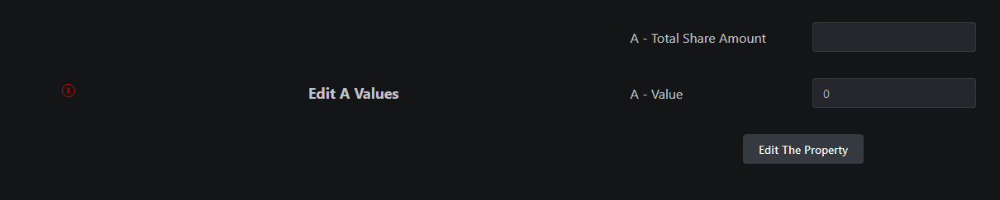

# 📪 My Portfolio

## What You Can Do

What Are The General Features of The App ?

1. Building Your Portfolio Based On Your Inputs.
2. Having Your Portfolio in a Cloud , and Editable in Cloud.
3. Showing Chart Based On Your Portfolio.
4. Tracking Crypto Currencies in US Dollar , Other Assests and Local Currencies Will Be Added.

## Build Your Portfolio Based On Your Raw Inputs

For Now The Inputs are Purely Raw and Your Responsible For the Prices just in The Portfolio. You Can Choose Types and define tags and share amounts and Value Per Share and Add It To Your Portfolio.

You Get a simple Pie Chart for now visualizing your assets And A Table That Give Options To Remove Or Edit Your Old Assets.

<figure><figcaption></figcaption></figure>

This is A Simple Editor That Let's You Edit Your Assets Values. You Can Access it By Clicking on The Pen that Exist in each Row Of The Table , You Can Also Delete The Each Asset By Clicking On the X button.

<figure><figcaption></figcaption></figure>
