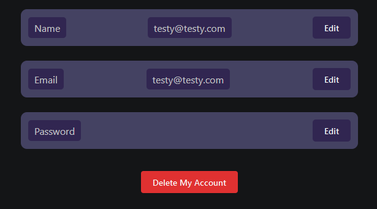
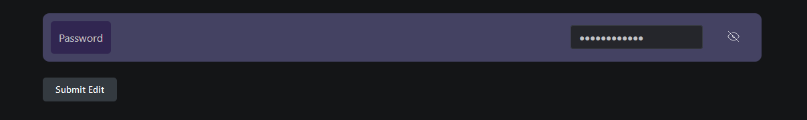

# 📪 User Dashboard

## What Do We Have in User Dashboard&#x20;

User Dashboard is pretty straight Forward , There are options to edit password , email and name . There is Also a delete account button that simply removes your user Info from the database. You Can always find the Codes to backend and frontend in my Github too.

A Simple Editor For Each One That is Activated By Clicking on Edit Button.

